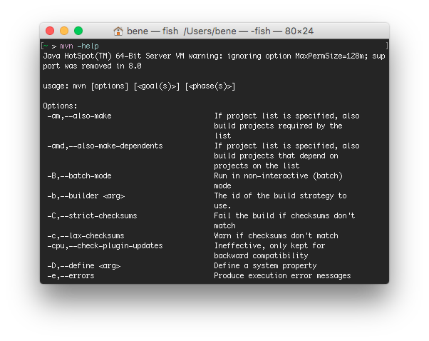
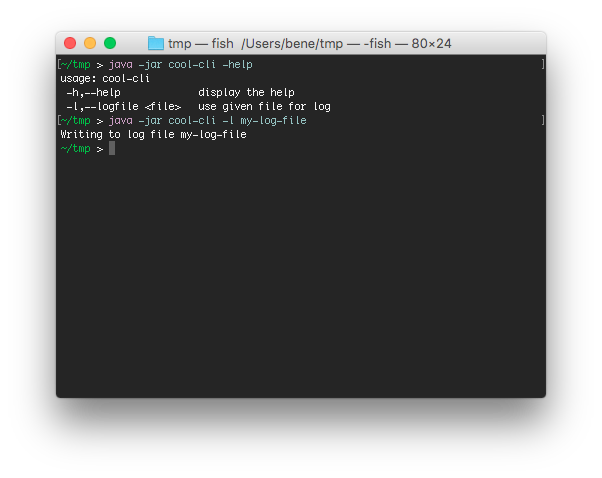

 <!-- .slide: data-background="img/background-green-16x9.png" data-state="intro" class="center" -->
## Components <!-- .element: class="heading" style="text-align: center;"-->
### Apache Commons CLI <!-- .element: class="heading" style="text-align: center;"-->

---

### Motivation

What I want:

<!-- .slide: class="center" -->



---

### Motivation

What Java gives me:

```java
public static void main(String[] args) {
  if(args.length > 0) {
    if("-help".equals(args[0])) {
      printHelp()
    }
  }
}
```

---

### Defining Options with Commons CLI

```java
Options options = new Options()
options.addOption("h", "help", false, "display the help");
options.addOption(builder("l")
                    .longOpt("logfile")
                    .hasArg()
                    .argName("file")
                    .desc("use given file for log")
                    .build());
```

---

### Parsing the Command Line

```java
CommandLine line = new DefaultParser().parse(options, args);
if(line.hasOption("help")) {
  new HelpFormatter().printHelp("cool-cli", options);
} else if(line.hasOption("file")) {
  this.logfile = line.getOptionValue("logfile");
}

```

---

### Result

<!-- .slide: class="center" -->

